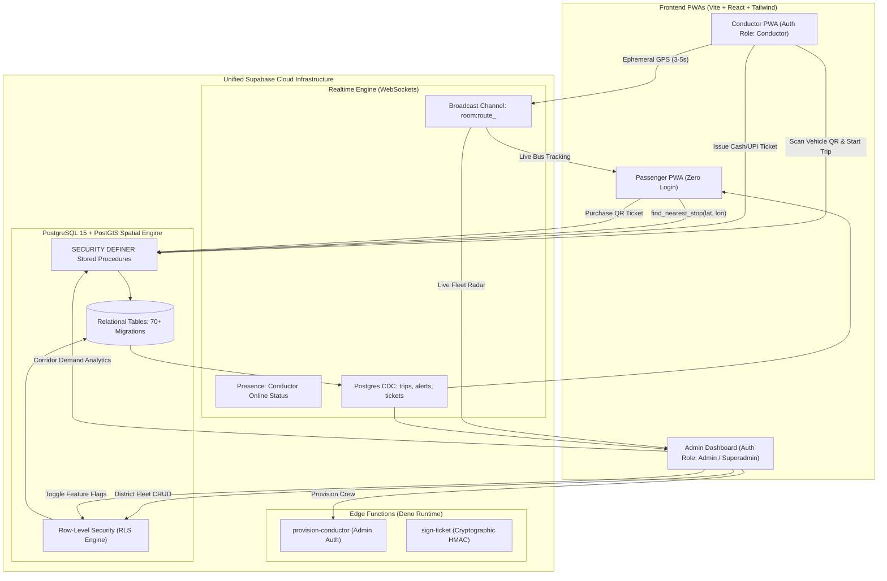

# Nigalthisai (நிகழ்த்திசை) — System Architecture

**Current Version:** 1.0.0 (Production-Ready Monorepo)  
**Target Environment:** Node 20+, Supabase (PostgreSQL 15+ with PostGIS 3+), Vite 5, React 18, TypeScript 5.6

---

## 1. Executive System Overview

Nigalthisai is a high-reliability, state-wide intelligent bus transit management and real-time tracking ecosystem. It is architected as an integrated TypeScript monorepo powered by Turborepo, featuring three dedicated Progressive Web Applications (PWAs) that interface with a shared Supabase PostgreSQL/PostGIS backend:

1. **Passenger PWA (`apps/passenger`):** Lightweight, zero-login rider experience. Supports PostGIS spatial nearest stop auto-detection, dynamic district and terminal filtering, real-time vehicle GPS radar tracking on OpenStreetMap tiles, and cryptographic QR ticket purchases.
2. **Conductor PWA (`apps/conductor`):** Operational interface for on-duty transit crew. Enforces physical bus QR verification before starting scheduled trips, streams high-frequency GPS telemetry via Supabase Realtime channels, computes dynamic route halts, and issues digital tickets.
3. **Admin & Superadmin Dashboard (`apps/admin`):** Enterprise transit mission control. Provides district-scoped fleet oversight, live corridor demand analytics, dynamic CRUD management (routes, stops, buses, conductors, schedules), system health telemetry, and runtime feature toggling via Supabase-backed feature flags.

---

## 2. Core Architectural Principles

- **100% Dynamic / Softcoded Invariant:** Zero mock data, zero hardcoded fallback lists, and zero phantom buses. Every route, bus, scheduled trip, alert, and district option is dynamically queried from the live Supabase PostgreSQL database.
- **Strict PostGIS Spatial Computing:** Geographic distances, nearest transit hubs, stop geofences, and spatial telemetry are calculated natively inside PostgreSQL using spherical earth geography functions (`ST_DWithin`, `ST_Distance`, `ST_SetSRID`).
- **Zero-Trust Financial & Transit RPCs:** Ticket issuance, QR verification, trip lifecycle transitions, and fare computations are executed strictly through atomic, transaction-safe `SECURITY DEFINER` stored procedures, protecting business logic from client-side tampering.
- **Low-Latency Hybrid Realtime Engine:** High-frequency GPS updates (every 3-5 seconds) bypass disk writes and stream ephemerally through Supabase Realtime WebSocket broadcast channels (`room:route_<route_id>`), while persistent state updates (trips, alerts, occupancy) synchronize via Postgres Change Data Capture (CDC).

---

## 3. High-Level Data Flow & Topology



---

## 4. Workspace Architecture

The monorepo is managed with Turborepo and npm workspaces:

```text
Nigazhthisai/
├── apps/
│   ├── passenger/                # Port 5173: Zero-login rider PWA
│   │   ├── src/pages/            # HomePage, LiveTrackingPage, TicketPurchase, MyTickets
│   │   ├── src/components/       # RouteSearch, BusCard, DynamicTicket, LeafletMap
│   │   └── src/hooks/            # useRealtimeBuses, useDetectLocation, usePWAInstall
│   │
│   ├── conductor/                # Port 5174: On-duty crew operations PWA
│   │   ├── src/pages/            # LoginPage, DashboardPage, ActiveTripPage, ScannerPage
│   │   ├── src/components/       # TripQRScanner, TelemetryStatus, HaltSelector
│   │   └── src/hooks/            # useGeolocationBroadcast, useTripLifecycle
│   │
│   └── admin/                    # Port 5175: Enterprise transit control center
│       ├── src/pages/            # DashboardPage, AnalyticsPage, LiveFleetRadar, ResourceCrudPage
│       ├── src/components/       # DistrictSelector, AdminControlCenter, CorridorDemandMap
│       └── src/guards/           # SuperadminGuard, DistrictGuard
│
├── packages/
│   ├── shared-types/             # Canonical TypeScript types & interfaces
│   │   ├── src/database.ts       # Generated & curated Supabase DB schema definitions
│   │   ├── src/domain.ts         # Domain models (Trip, Route, Bus, Stop, Ticket, Alert)
│   │   └── src/rpc.ts            # Input/output contracts for stored procedures
│   │
│   ├── supabase-client/          # Singleton client, RPC call wrappers, auth state helpers
│   │   ├── src/client.ts         # createClient singleton with storage isolation
│   │   ├── src/rpc-helpers.ts    # Type-safe wrappers for 15+ database RPCs
│   │   └── src/realtime.ts       # Route broadcast channel subscription managers
│   │
│   └── ui/                       # Reusable accessible component library
│       ├── src/components/       # Button, Card, Badge, Modal, Input, Toast, Skeleton
│       └── tailwind-preset.cjs   # Unified brand tokens (Navy-600, Brand-500, OLED canvas)
│
└── supabase/
    ├── migrations/               # 70 sequential SQL migrations
    └── functions/                # Edge Functions (provision-conductor, sign-ticket)
```

---

## 5. Database Schema & Security Architecture

### 5.1 Key Database Tables
- **Districts & Networks:** `districts`, `depots`
- **Spatial Transit Graph:** `stops` (with PostGIS `geography(Point, 4326)`), `routes`, `route_stops` (ordered stop sequences with travel time and intermediate kilometer markers)
- **Fleet & Personnel:** `buses` (vehicle registration, capacity, QR seed), `conductors` (badge number, government ID), `profiles` (role-based auth profiles)
- **Operational Lifecycles:** `schedules`, `trips` (`scheduled`, `in_transit`, `completed`, `cancelled`), `trip_occupancy` (live passenger counter)
- **Financial & Ticketing:** `fare_matrix`, `tickets` (UUID, verification QR hash, origin, destination, status)
- **Fleet Telemetry & Incidents:** `bus_telemetry` (historical spatial trails), `alerts` (SOS, breakdown, route deviation), `maintenance_logs`
- **System Configuration:** `system_feature_flags` (runtime flags for Admin, Conductor, and Passenger feature gates)

### 5.2 Row-Level Security (RLS) Matrix
Every single table in the schema has PostgreSQL Row Level Security enabled (`ALTER TABLE ... ENABLE ROW LEVEL SECURITY`):

| Table | Anonymous (Passenger) | Conductor (Authenticated) | Admin / Superadmin |
|---|---|---|---|
| `districts`, `stops`, `routes` | SELECT (Read-only) | SELECT (Read-only) | ALL (CRUD) |
| `buses` | SELECT (Active fleet) | SELECT (Assigned depot) | ALL (CRUD) |
| `trips` | SELECT (Filtered: active & scheduled) | SELECT + UPDATE (Own active trip) | ALL (CRUD) |
| `tickets` | SELECT (Own session/UUID) | SELECT + UPDATE (Validate tickets) | ALL (CRUD) |
| `alerts` | SELECT (Active broadcast alerts) | SELECT + INSERT (SOS/Breakdown) | ALL (Full management) |
| `system_feature_flags` | SELECT (Public flags) | SELECT (Public flags) | ALL (Superadmin toggle) |

### 5.3 Core Stored Procedures (`SECURITY DEFINER`)
All sensitive transactions run through battle-tested RPCs:
1. **`find_nearest_stop(user_lat, user_lon, max_dist_meters)`**: Uses PostGIS spatial indexing to return the nearest transit stop and terminal information within milliseconds.
2. **`verify_bus_qr(p_qr_code, p_conductor_id)`**: Enforces physical crew presence inside the specific bus before a trip can transition to `in_transit`.
3. **`start_trip(p_trip_id, p_bus_id, p_conductor_id)`**: Transitions a scheduled trip into an active state, assigns crew, initializes occupancy tracking, and creates the telemetry broadcast room.
4. **`end_trip(p_trip_id, p_conductor_id)`**: Atomically finalizes the trip, records total duration, closes open tickets, and frees the bus for subsequent assignments.
5. **`compute_route_demand_analytics(p_district_id)`**: Aggregates ticket volume, seat occupancy trends, and peak corridor utilization dynamically for the admin dashboard.

---

## 6. Realtime Communication Protocol

Nigalthisai employs a dual-channel communication strategy:

### Channel 1: Ephemeral GPS Telemetry Broadcast
- **Protocol:** Supabase Realtime WebSocket Broadcast
- **Channel Name:** `room:route_<route_id>`
- **Payload:**
  ```json
  {
    "type": "telemetry",
    "trip_id": "b93c83bb-40f9-4b6f-8dcb-13491ba68fc1",
    "bus_id": "929d2f21-72f5-46aa-bd42-4fcf13be3ba7",
    "registration_number": "TN-49-N-2184",
    "latitude": 10.7870,
    "longitude": 79.1378,
    "speed_kmh": 38.5,
    "heading": 142.0,
    "timestamp": 1727458200000
  }
  ```
- **Rationale:** Writing telemetry to PostgreSQL every 3 seconds for hundreds of moving buses creates unnecessary database write IOPS and table bloat. Broadcast channels deliver sub-100ms latency to riders with zero database footprint.

### Channel 2: Change Data Capture (CDC)
- **Protocol:** Postgres Changes over WebSockets
- **Tables Monitored:** `trips` (status changes), `alerts` (emergency broadcasts), `trip_occupancy` (boarding updates).

---

## 7. Dynamic Feature Flags Architecture

In `apps/admin`, the **Control Center** allows Superadmins to enable or disable features dynamically without redeploying code:
- `passenger_live_tracking`: Toggles GPS vehicle radar on rider devices.
- `conductor_qr_verification`: Requires conductors to scan bus physical QR codes before trip launch.
- `ticket_qr_generation`: Controls digital ticket issuance.
- `sos_emergency_broadcast`: Activates state-wide emergency banner protocols.

The flags are stored in the `system_feature_flags` table, cached with reactive invalidation in the admin app shell, and immediately enforced on route guards.